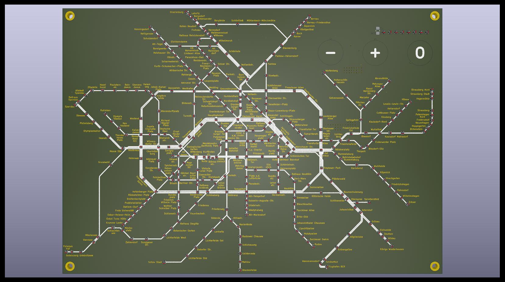

# Public Transport Map of Berlin

There are some commercial maps of similar design out there. They mostly use multiple LEDs per station and show less complexity by splitting services into separate maps.

This project shows the complete maps for Berlin’s suburban rail and subway. It uses 312 NeoPixel-compatible RGB LEDs for 314 stations on a two-layer board. A standard ESP32 dev module is used to get live transport data. It will be replaced by a board supporting PSRAM for flexibility.

## PCB Design

The PCB design is done in KiCad 9. It uses SK6805-EC10-000 NeoPixel-compatible LEDs by OPSCO connected in one non-intersecting path.

The LEDs are only 1.1×1.1 mm in size and can be sourced from JLCPCB for PCB manufacturing and assembly.

The current PCB size is 153×107 mm, which is roughly the size of a DIN A6 sheet.

It is an improved but untested version of the original test design.

Scaling of the PCB can be done with a Python script. It includes automatic placement of the LEDs and routing in between. The scaled version only needs adjustment of the text size and placement of the ESP32 dev module connector.

## Software

The software is developed using VS Code, PlatformIO, and ESP-IDF. It is not documented, but the project can be compiled if you have a working setup.

It uses the REST API from derhuerst <https://github.com/derhuerst/bvg-rest> to get information about active rides on a certain suburban or subway line and displays the station where the train arrives next. It currently supports displaying only one line at a time due to a memory shortage.

### Features

- provisioning
- HTTP OTA server
- capacitive touch
- NeoPixel LED control
- display live train data

The HTTP OTA server is not secure and allows anyone to upload any firmware. It can be enabled by touching the "O" button during the startup sequence (blue blinking status LEDs). Similarly, provisioning data also gets removed.

## Scaling

The PCB has been designed to be minimal in size to reduce manufacturing cost. It can be scaled using the KiCad IPC API. This requires KiCad 9 and above. The IPC API has some quirks, but first it needs to be enabled in the KiCad settings.

## Pictures

